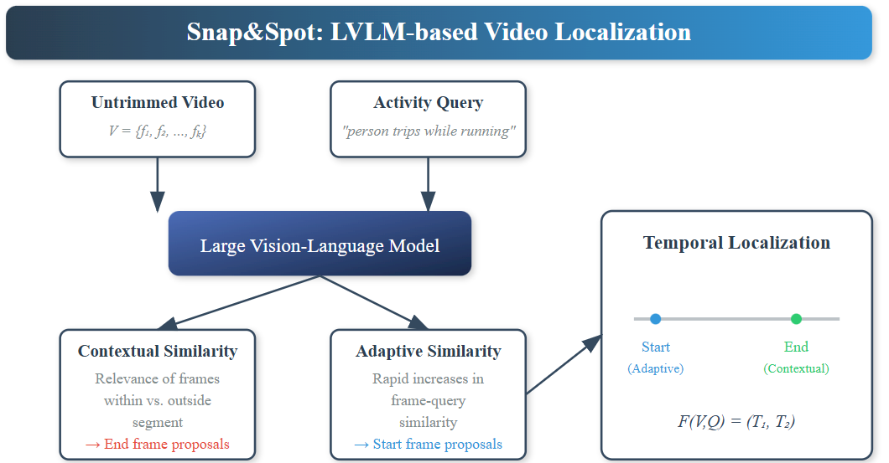

<div align="center">

# Snap&Spot: Leveraging Large Vision Language Models for Train-Free Zero-Shot Localization of Unusual Activities in Video
[**Hasnat Md Abdullah**](https://github.com/Hasnat79)

Texas A&M University

</div>

<!-- ## 📜 Abstract -->


<div align="center">
  
</div>

## 🔧 Getting Started
- Clone this repository
```bash
git clone https://github.com/Hasnat79/Snap_n_Spot
```
- init the submodules (foundation_models)
```bash
git submodule update --init --recursive
```
## 🚀 Installation

To install the necessary dependencies, run:

```bash
conda create -n snap
conda activate snap
pip install -r requirements.txt
```
- creates an anaconda environment named `ual-bench` and installs the necessary dependencies.

## 📂 Dataset


[/data](data) directory contains [charades-sta](data/charades-sta/charades_test.json) and [uag_oops](data/uag_oops_charades_format.json) annnotation files. [oops_video/val](data/oops_video/val) contains the videos of UAG-OOPS dataset. [charades-sta](data/charades-sta) contains the videos of the Charades-STA dataset. 


### ⚙️ Blips2 feature generation
```bash 
cd src
python feature_extraction.py 
```
- genrates blip2 features for the videos in the [data](data) directory in numpy format


## 🧠 Methodology
```bash 
cd src
python evaluate.py --dataset uag_oops
```
- generates the metrics for zero-shot unusual activity localization on UAG-OOPS dataset using the Snap&Spot pipeline.
<details>
  <summary> Click to see the output format </summary>
  
  Expected output format:
  ```bash 
  R@0.3: 0.6620967741935484
  R@0.5: 0.49489247311827955
  R@0.7: 0.23951612903225805
  ```
 </details>


## 📝 Evaluate any dataset using Our methodology
- set up the dataset in the [data_configs](src/data_configs.py) file
- generate the features using the [feature_extraction.py](src/feature_extraction.py) file
- run the evaluation using the [evaluate.py](src/evaluate.py) file

**Note**: You need to make sure you are updating the paths correctly in the config file and inside the scripts.


